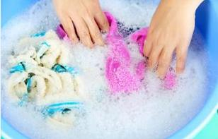

# 常识：怎么做家务可以保护腰椎？

很多人不喜欢做家务，就是因为做饭、洗衣、扫除等家务活，都在不经意间伤害着她们的腰。所以空有一颗想做的心，却无能为力。只要你掌握了“做家务时的动作要点”，就能预防腰痛。

## 洗衣服

收拾衣物、搓洗、晾晒时弯腰把衣服从盆里捞出来，这些都会对腰部产生很大的负担。建议不要把装衣物的盆或晾衣篮放地上，而应放在较高凳子上，这样能降低腰部前倾的程度，减轻腰部负担。同理，叠衣物时也不要坐在地板上或床上叠，而是应铺在桌子上叠。

## 大扫除

拖地、使用吸尘器时，如果手柄的长度不够，人自然而然需要弯腰用力，给腰部带来极大负担。建议调节手柄长度，以握着时肘部微曲、躯干微弯为宜。此外，擦拭桌椅板凳时，也应避免弯腰去擦，宁可麻烦点蹲下来或坐着擦。

## 做饭

在厨房里洗菜做饭通常一站就是二三十分钟，甚至更久。建议将一个高度10厘米左右的小板凳放地上，两只脚轮流踩在上面，并与另一只脚之间隔开半步距离，这样可以减轻腰部负担。另外，腹部贴着厨台可以分散腰部压力。从位置较高的橱柜取物时，应该站在凳子上去拿，不要勉强伸臂踮脚去够。

## 购物

去超市购物，不论东西多少，最好都要用手推车，因为提购物筐或手提袋会给腰部带来负担。另外，购物时最好带双肩包，这样回家路上对腰部负担最小。如果实在要拎着走的话，应尽量将物品按重量平均放在两个袋子里，左右手各提一个，以保持身体重心平衡，减轻腰部负担
